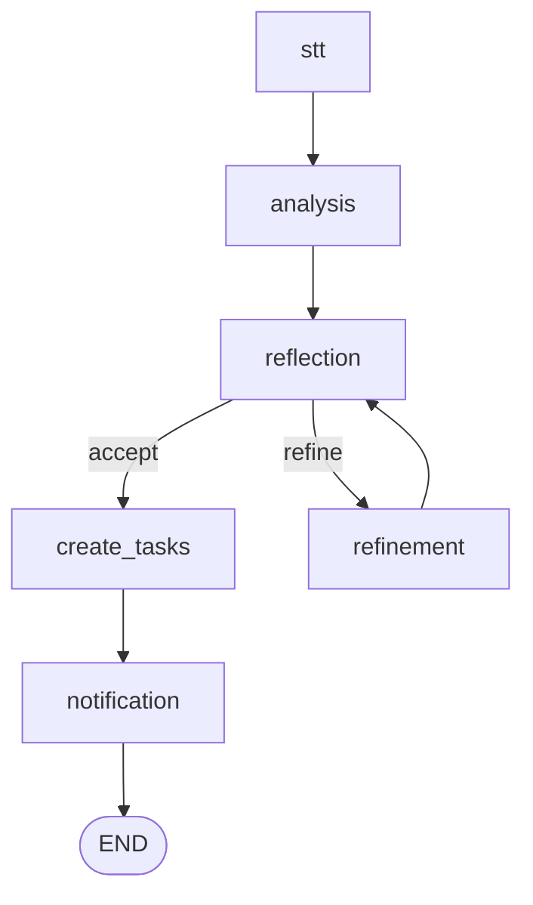

# Dacnnt - Meeting to Task Agent

This project implements an AI agent that processes audio recordings of meetings, transcribes them, generates Minutes of Meeting (MoM) and action items, and, after a human review, automatically creates tasks and sends notifications. The agent is built using Python, LangGraph, and various AI models, and includes a web-based UI for the human-in-the-loop review process.

## Features

- **Audio Transcription:** Automatically transcribes meeting audio files to text using state-of-the-art speech-to-text models.
- **AI-Powered Analysis:** Uses large language models (LLMs) to analyze the transcript and generate a concise summary (MoM) and a structured list of action items.
- **Self-Correction:** The agent includes a reflection and refinement loop where it critiques its own output and attempts to improve it before presenting it to the user.
- **Human-in-the-Loop:** The workflow intentionally pauses to allow a human to review, edit, and approve the generated MoM and action items through a user-friendly Gradio web interface.
- **Automated Task Creation:** Once approved, the agent automatically creates tasks in a backend system based on the action items.
- **Email Notifications:** Sends email notifications to the individuals assigned to the newly created tasks.
- **Containerized Services:** Uses Docker and Docker Compose to manage the Weaviate vector database and other related services.

## Workflow

The agent's workflow is defined as a graph using LangGraph. Here is a high-level overview of the steps:

1.  **Speech-to-Text (STT):** The input audio file is transcribed into text.
2.  **Analysis:** The transcript is analyzed by an LLM to produce the first draft of the MoM and action items.
3.  **Reflection:** The agent critiques the draft for quality and completeness.
4.  **Refinement (Conditional):** If the reflection step identifies issues, the draft is refined by the LLM based on the critique. This can loop a few times.
5.  **Human Review (Interrupt):** The process pauses, and a Gradio UI is launched. The user can review and edit the MoM and action items.
6.  **Create Tasks:** After the user saves their changes in the UI, the workflow resumes, and the agent creates the tasks in the designated project management system.
7.  **Notification:** The agent sends email notifications to all task assignees.

The graph structure can be visualized as follows:



## Getting Started

### Prerequisites

-   Docker and Docker Compose
-   Python 3.11
-   An environment that can run Jupyter notebooks.

### Installation & Setup

1.  **Clone the repository:**
    ```bash
    git clone <repository-url>
    cd Dacnnt
    ```

2.  **Set up the Python environment:**
    It is recommended to use a virtual environment.
    ```bash
    python -m venv .venv
    source .venv/bin/activate  # On Windows, use `.venv\Scripts\activate`
    pip install -r requirements.txt
    ```

3.  **Configure Environment Variables:**
    Create a `.env` file in the root of the project by copying the `.env.example` file (if provided) or creating a new one. Fill in the necessary API keys and configurations.
    ```
    OPENAI_API_KEY="your-openai-api-key"
    GOOGLE_API_KEY="your-google-api-key"
    # Other configurations
    ```

4.  **Security Warning:**

    > **IMPORTANT:** The `docker-compose.yaml` file in this project contains hardcoded API keys. This is a significant security risk. Before using this project, you **must** remove the hardcoded keys and load them from a secure source, such as the `.env` file or another secrets management system.

    Modify the `docker-compose.yaml` file to remove the hardcoded keys and replace them with variables that will be loaded from the environment. For example:
    ```yaml
    environment:
      OPENAI_APIKEY: ${OPENAI_API_KEY}
      GOOGLE_APIKEY: ${GOOGLE_API_KEY}
    ```

### Running the Project

1.  **Start the Docker Services:**
    Run the following command from the root directory to start the Weaviate vector database and other services:
    ```bash
    docker-compose up -d
    ```

2.  **Run the Agent:**
    The primary way to run the agent is through the provided Jupyter notebooks (`demo.ipynb` in `src/agents/meeting_to_task/`).
    -   Launch Jupyter Lab or Jupyter Notebook from your activated virtual environment.
    -   Open the notebook and follow the steps to provide an audio file and metadata.
    -   When the agent reaches the human review step, it will provide a link to the Gradio UI.
    -   Open the link, review the information, make any necessary edits, and click "Save & Continue".
    -   Return to the notebook and run the next cell to continue the workflow.

## Technologies Used

-   **AI / Machine Learning:**
    -   LangGraph & LangChain
    -   OpenAI GPT-4o, Google Gemini
    -   Faster Whisper (for audio transcription)
    -   Hugging Face Transformers
-   **Backend & API:**
    -   FastAPI
-   **Database:**
    -   Weaviate (Vector Database)
-   **UI:**
    -   Gradio
-   **Containerization:**
    -   Docker, Docker Compose
-   **Development:**
    -   Python 3.11
    -   Jupyter Notebooks
